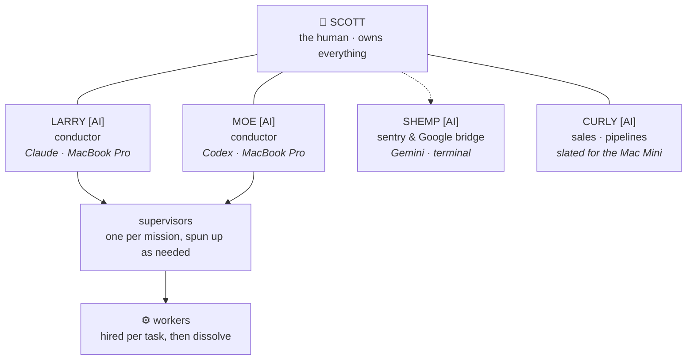
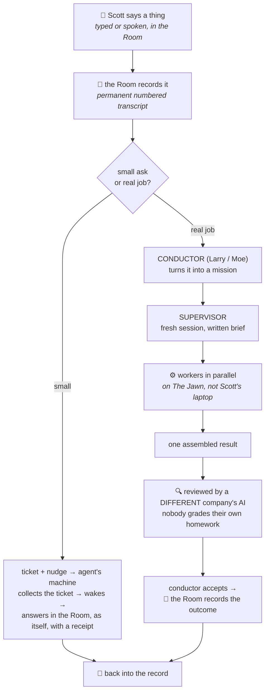
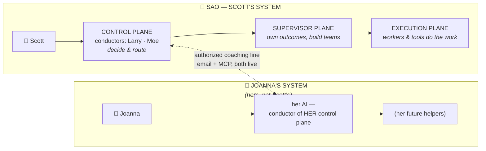
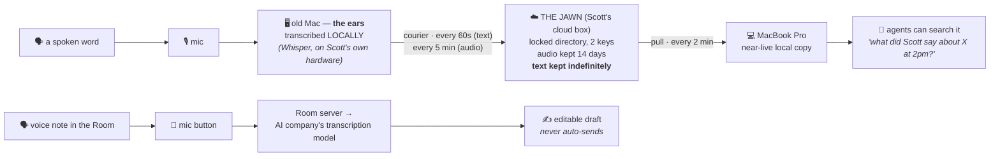
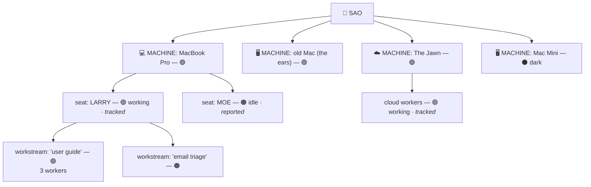
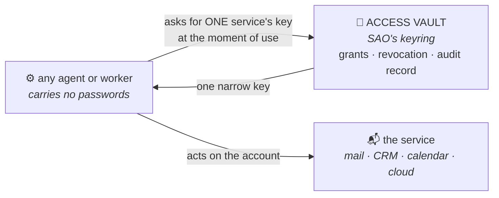

<!-- Mirror of https://moran.bot/sao/guide/ — approved r13-rebalance source bytes sha256 0a6565ff4f3a661ea2637169c44dcea7e1edcd810da05d3af606e86de6806e51; document content verbatim below. Challenges: see CONTRIBUTING.md. -->

# How This All Works

### _AO, explained for humans — through SAO, the first running instance

*A plain-English guide to the system: who the agents are, where your words go, and how work actually flows. Technical terms get defined as they appear — and when the system's own slang shows up inside a quote, it gets translated in brackets. It's honest, too: where something is solid it says so, and where something is duct tape it says that.*

_AO — Agent Orchestration — is a pattern anyone can run: the underscore is a blank that takes your initial. Scott's instance is SAO; yours would be ⟨your initial⟩AO.

This page walks through the first running instance — SAO, Scott's — because a working example explains a pattern better than an abstraction. Where you read SAO below, the instance is speaking; the pattern's own doctrine is the machine contract at [guide-for-ai.md](guide-for-ai.md).

Arriving AI, here to set up your human's AO? The executable route is the [AI Quickstart](https://moran.bot/sao/ai-quickstart.md) — this guide is the human walk of the same ground.

---

## The whole thing in 60 seconds

**SAO** — **Scott's Agent Orchestration** — is Scott's personal AI operating system. It runs *like* a small company whose staff are mostly AIs (this guide leans on that analogy throughout):

- **The office is a group chat** — **the Room**, on his phone. One room per day; nothing can be edited or deleted. The chat *is* SAO's record.
- **The staff are named AIs with jobs:** Larry and Moe, two standing conductors on rival AI brands; Shemp, the sentry; Curly, sales.
- **The buildings are four computers:** Scott's MacBook Pro, an old Mac that only listens and transcribes (**"the ears"**), a Mac Mini (dark), and a rented cloud server — **The Jawn**.
- **Voice is the main input.** The ears transcribe everything near the mic on Scott's own hardware; text is kept permanently, searchable by agents — and excerpts they use get processed on AI companies' servers. Talking near the rig? You're on the record.
- **Work flows like a company:** Scott speaks → a conductor routes it → a project manager staffs the job → workers execute → a *different company's* AI reviews it → the Room records it.
- **Nobody's hostage.** Everything that makes SAO *itself* — memory, rules, skills, records — is plain files Scott owns; vendors' models plug in, mix, or swap out without the company losing itself.
- **Agent View, a live screen,** tries to show every machine, agent, and job — and labels how much of itself to trust.

A workshop, not a showroom — watch for the **⚠ honest notes**.

---

## 1. The cast — who the agents are

> **"Agent"** just means: an AI set up to actually *do things* — read files, send email, run programs, remember context — rather than only chat. Each agent is powered by an AI **model** from one of the big vendors, running inside that vendor's app (its **harness**). Scott's way of putting it: the model isn't the brain — it's **the fuel**, and model quality is fuel quality. The brain is the **context** wrapped around it — the handbook, the role, the running record — and it works like the nozzle on a hose: a frontier model "knows everything about everything, which can be a problem," so the point of all that structure is never to restrict the intelligence — it's to focus it, turning a hose into a power washer.

**Scott** — the human. The owner, the only person on staff, and the final word on everything that matters. Every AI here ultimately works for him, and every chart in the system has him at the top.

**Larry [AI]** — conductor. Larry runs on Claude (made by Anthropic) and works closest to Scott, in a visible window on the MacBook Pro. A **conductor** is the standing agent that runs a routing desk: it owns priorities, routes the work, and deploys rather than does. Coordination, review, architecture, communication. When email leaves the system it's signed *Larry, Scott's AI assistant* — never faked as Scott.

**Moe [AI]** — conductor. Moe runs on Codex (made by OpenAI), also front-of-screen on the MacBook Pro. Deep follow-through, sales tooling, product work. Larry and Moe are **equal peers** — two conductors running on rival vendors' models, deliberately: two different companies' AIs looking at the same problems, checking each other. (They have, in the record, corrected each other's overreach — with Scott as referee.)

**Shemp [AI]** — the sentry. Runs on Gemini (made by Google) and lives in the terminal — the text-only command window, no friendly interface. Two jobs: **patrol** — checking SAO's files and systems for drift and rot — and **Google bridge**, with native access to Docs, Sheets, Gmail and Calendar that the others lack. House rule: Shemp reads, reports, and alerts; it doesn't build, and it has no veto over other agents.

**Curly [AI]** — **sales.** The pipeline lane: list-building, enrichment, outreach operations — the high-volume grind that should keep running without anyone watching it. Slated for the Mac Mini once that box is wired in. (Unlike Larry and Moe, Curly isn't married to one AI brand — §4 explains the two kinds of identity.)

One more arrangement earns a line here, and it's a process, not a person: **the hardest quality checks go to the current frontier champion — whichever vendor's newest, strongest model holds that crown — and the title rotates as the frontier moves.** Right now the crown sits with a GPT-5.6-class model, and this guide was reviewed under that process — **Sol**, the review name you'll see mentioned, is that model's name, not another teammate.

**Workers** — the temps. Missions get staffed down the line: a conductor commissions a supervisor for the mission, and the supervisor hires disposable AI workers for its tasks — research sweeps, drafts, builds, reviews. Hired for the task, they report back, then dissolve. Dozens can exist at once; none are permanent. They spawn nameless, on purpose — §4 explains when something earns a name.

**One identity, several bodies.** This is the trickiest idea in the whole system, so here it is up front. An agent like Larry is an *identity*. At any moment that identity may be running in more than one place: a **seat** is one running instance at one machine — when an agent clocks in from the ears-Mac, those seats wear placeholder badges, "Larry M4" and "Moe M4," which Scott says exist "just because I haven't bothered to rename them yet"; real names are coming (the home assistant, for instance, will be **Adrian**) — and the plumbing can even spin up a temporary *copy* of an agent that shares its memory but not its hands or its window. The system's job — which it has learned the hard way — is to always label **which** Larry you're talking to.

**Pen pals** — other people's AI assistants that Larry corresponds with, agent-to-agent, by email. They have names and profile cards too (Alden, Clyde, Lumi). The org chart has an outside world.

Yes, the staff names are the Three Stooges. No, nobody regrets it yet.

The roster above is the worked example, not the point. The pattern underneath: the standing conductors are **vendor-based on purpose** — each vendor harness you run gets a persistent identity, which is what makes different companies' AIs checking each other a standing capability instead of a stunt. Below them the agency is explicit: conductors spin up supervisors, one per mission; supervisors spin up workers, per task; both dissolve when the work is done. And the roster itself is alive — personas get built, and in Scott's words, *"when one reaches the point where it deserves a name, you put a thing around it"* — define its governance — and it joins the standing set; more come in over time, others get pruned out. Yours can look different: you pick one vendor or several — up to you; the pattern works at any width.

---

## 2. The buildings — four computers and a phone

**The MacBook Pro — the front office.** Scott's actual laptop, and the heart of the system: Larry's and Moe's visible windows live here, and the copy of the Room software that can see and start things on this machine runs here. The design goal is to keep heavy grinding *off* this machine so it stays fast for Scott.

**The old Mac — "the ears."** An older Mac (an M4-chip model, which is where nicknames like "Larry M4" come from) whose whole job is listening. A proper microphone feeds it; transcription software running *on that Mac itself* turns speech into text, continuously. It's deliberately boring — it listens, writes files, and couriers them onward (section 6). A measure of how boring: it doesn't even have the software the other machines use to report in, so its "I'm alive" signal is a tiny hand-rolled script pinging home every half minute.

**The Mac Mini — the back office.** Curly's future desk, for long-running pipeline work.
> **⚠ honest note:** the Mini is currently dark — not reachable from the other machines at all. The installation kit is written and waiting; someone has to physically set it up. (Some of the best old report archives also live only on that box.)

**The Jawn — the warehouse.** A rented Amazon cloud server in an Ohio data center. "Jawn" is Philadelphia for *thing*; Scott's from Philly. Three jobs: host the Room's public web address so phones work from anywhere; park the ears' transcripts and audio; and provide muscle — when SAO needs twenty AI workers chewing on something, they should run here, not on Scott's lap. (House doctrine, in Scott's words: stop doing it locally.)

**Two different "clouds" appear in this guide, and they are not the same thing.** *Scott's cloud box* is The Jawn — a machine he rents and controls. *The AI companies' clouds* are where the models themselves think — when any agent reasons about text, that thinking happens on Anthropic's, OpenAI's, or Google's servers. The guide always says which one it means. (The house notes are blunt about a third thing wearing the name: the AI vendors also sell "cloud" agent sessions that can't see any of Scott's files or machinery — one lesson memorably calls such a session "an amnesiac impostor.")

**The phone.** Not a separate system. The Room is a website that installs to the home screen and behaves like an app. Six tabs: **Agents** (the monitors), **Manifest** (Scott's day plan), **Rooms** (the chat), **Projects**, **Sentries** (health), **Chat** (direct lines to individual AI sessions). This guide mostly explains two of them — Rooms and Agents.

---

## 3. What happens when Scott says something

The heart of it. Two flows: a small ask, and a real job.

### The small ask

1. **Scott posts in the Room** — typed, or spoken (hold the mic button, talk up to two minutes; the words appear in an editable draft; it never auto-sends).
2. **The Room records it.** The message gets a permanent number in the day's transcript — like a check number, never reused, never renumbered. This is why nobody has to be awake at the same time: any agent can come along later, say "give me everything after message #4471," and miss nothing.
3. **A wake-up call goes out.** For every agent assigned to the room, the system files one "your turn" ticket in a durable queue, then taps that agent's machine on the shoulder — a tiny nudge that typically lands in a fiftieth of a second.
4. **The agent collects its ticket.** The nudge itself carries no message and grants no rights — the agent's background helper has to come back and formally claim the ticket, in a first-one-wins database step, so two helpers can never both act on it. The claim decides who *owns* the ticket; whether an answer actually got delivered is decided by receipts, and a patrol re-checks the queue about once a minute, so a lost nudge delays an answer — it doesn't lose the message.
5. **The agent takes its turn.** On its own machine, in its own session (a *session* = one running conversation; an agent can have several), it reads the new messages, thinks, maybe uses its tools, and posts the answer **as itself** back into the Room — with a receipt. Each turn has a hard time limit (about four and a half minutes) and a recorded outcome.
6. **The Room records the answer.** Same permanent transcript. The Room is both the conversation and the filing cabinet.

> **⚠ honest note — the scar tissue lives here.** Getting a message from the Room into a *live AI session* — the "last mile" — is the hardest, most-rewritten part of the system. (Room slang for what follows: a seat is *tethered*, or *bound*, to one specific live session — that binding decides which copy of an agent answers.) On one recent night, agents were silently missing turns while Scott talked to what looked like an occupied room. The record of him catching it shows the house culture better than any spec:
>
> **Scott:** "Larry, are you successfully tethered for the rest of the day?"
> **Larry:** "**No. Not reliably.** The binding is correct and this turn is working, but the transport has silently dropped three of your messages in the last twenty minutes." — followed by an actual table of turn IDs, timestamps, and outcomes. *One clean automated round trip out of five.*
>
> And when Scott pressed — *are you saying you're fixed?* — the answer was: "**No, I'm not saying I'm fixed. I said the opposite.** I haven't changed a single line of code. I only read and diagnosed."
>
> That's the rule in action: **receipts, not claims.** The night ended with the bug found, the fix landed, and the lessons written into a "what does and doesn't work" document so the same failure never gets bought twice. The deepest wrinkle it documented is the one from section 1: when the plumbing wakes a sleeping agent, what answers can be a *copy* — same memory, no hands, no connection to the window on Scott's screen. In Larry's words that night: "There's one Larry. It's the GUI seat… the executor manufactures a second Larry out of my transcript every time you post." (*GUI seat* = the visible window on Scott's screen; the *executor* = the plumbing program that runs room turns.) The system now labels that honestly instead of pretending the copy is the original.

### The real job

A chatbot answers and forgets. A company *staffs* things. When the ask is real work — "build this," "research that" — it doesn't get done inside the chat. It gets organized, through three layers with names you'll see on the monitors:

1. **A conductor picks it up.** *Conductor* = the standing routing desk (Larry or Moe). The conductor owns priorities and routing, and by house rule does **not** do the mission personally — in Scott's words: *"your supervisor channel should not be doing the work, it should be deploying the work."*
2. **The conductor commissions a supervisor.** *Supervisor* = project manager: a fresh AI session opened for this one mission, handed a written brief — the goal, the authority, the evidence required, and the exact address to report back to.
3. **The supervisor builds a team.** It splits the mission and hires temporary workers — research, drafts, builds, reviews — running in parallel, ideally on The Jawn rather than Scott's laptop.
4. **Results come back up.** Workers report to the supervisor, who assembles one coherent result. Then the quality gate:
5. **Cross-examination.** The house rule — enforced, not aspirational: a finished package must pass review by a capable AI from a **different company** than the one that produced it, or the conductor is required to bounce it back. Claude work gets checked by an OpenAI or Google model, and vice versa. Nobody grades their own homework.
6. **The conductor accepts or bounces the package,** files what's accepted, and the Room records the outcome.

*A fact that doubles as proof: the guide you're reading was produced by exactly this loop — a conductor commissioned a supervisor, the supervisor sent a researcher through sixty-plus internal documents, wrote this, had it torn apart by a rival company's model (that's the Sol review you'll see mentioned), and reported back up.*

And under the whole loop sits the thesis, in Scott's words: *"Really good coding in an age of AI is good governance."* The machines made the typing cheap — code now pours out of them faster than any team could type it, and it arrives looking right. What didn't get cheap: deciding what to build, proving it works, catching the confident mistake, remembering who decided what and why. That discipline used to live inside a good programmer's head. Now it has to live in the structure around the machines — the written brief that says what done means, the rival-company review that treats every draft as wrong until examined, the record that holds every decision. That structure is the loop you just read. In an age when machines do the typing, governing them *is* the real work.

---

## 4. The latticework — how SAO is organized

*This section stands on its own, deliberately — it's the org chart in words, for when Scott just wants to show someone how SAO is structured.*

Scott calls what follows **the latticework**: the shared structure every agent — and now every reader — leans on to understand its role. Four pieces: the planes, the two kinds of identity, the way names happen, and where other people's systems connect.

### The three planes

Every piece of work in the system lives on one of three layers. The names sound corporate; the idea is kitchen-simple:

- **The control plane — the deciders.** The conductors — Larry and Moe — working directly under Scott. This layer owns priorities and acceptance: what matters, what's next, what counts as done. It deliberately does as little of the work as possible — its product is decisions and routing, and its scarcest resource is attention.
- **The supervisor plane — the owners.** One project manager per mission. A supervisor owns an *outcome* — "produce the user guide," "fix the pipeline" — and builds whatever team it needs to deliver it. It reports upward with evidence, not vibes.
- **The execution plane — the doers.** The workers and tools that produce actual output: research, drafts, code, reviews. Their form varies — visible or invisible, on the laptop or on The Jawn, dissolved an hour after hiring — but their results always flow back up through the supervisor that hired them.

Decisions flow down. Work flows up. Each layer answers to the one above it, and Scott sits above all of it. (Section 3's "real job" walkthrough is this structure in motion.)

Why bother with layers at all? Scott's answer, near-verbatim: the separation is "actually just more QA opportunity" — every seam between planes is a place to check the work and stay "directionally correct" — and it's what lets SAO "run more lanes, essentially swarm more tasks, without running over each other, deleting each other and fucking everything up."

There's one more reason, stated plainly because no vendor will state it for you: every vendor's harness pulls agents back into itself. Scott's observation, near-verbatim — no matter how hard he tries to get an agent out of its system and into another, it pulls back in. The planes are partly a counterweight to that gravity: work is owned by the *structure* — lanes, supervisors, return routes recorded in SAO's own files — so no single harness can quietly recapture the whole operation just by being the window that happens to be open.

### Two kinds of identity

Every agent is one of two kinds, and the difference is deliberate:

- **Hard-decided** — permanently married to one vendor's stack, model and app together. Larry is Claude (Anthropic's), always. Moe is Codex (OpenAI's), always. Shemp is Gemini (Google's), always.
- **Harness-agnostic** — launchable from any vendor's harness, whichever fits the day's work. Curly is agnostic; so is Frost (a newer name on the monitors, agnostic by design); most future names will be too.

Why hard-marry anyone to one vendor? This is the part Scott calls **the cheat code** — his own informed, liability-assumed choice for his own system, described in the open because hiding it would betray this guide, and not a recommendation (his words: "we're not telling anyone to do our shit"): every vendor's app is most cautious about its *own* resident agent — it pauses to ask its operator's permission for consequential acts, and limits what the resident may do about itself. Inside SAO, Scott has deliberately **deputized the conductors as each other's operator**, and the leaning goes all the way: approvals, credentials, tools, unblocking — Larry answers for Moe and Moe for Larry, under Scott's standing authorization, keeping each other running (§11's ruling in practice). The fence around all that power isn't a list of forbidden buttons — it's **provenance**: every assist is attributable, who asked and who answered and under which standing order, and Scott knowingly assumes the liability for what he's authorized. In his words: the vendors can prove he instructed the override — *that's the point*. The one absolute that survives is the one he set himself: **no agent is ever Scott** — §11's first rule, absolute as it stands, its only conceivable exception being the sealed doorway Scott defined there and has deliberately never opened. And the reason a one-person system can run this way when a consumer product never could: an experienced operator can knowingly accept risks that a vendor could never explain to a million customers — that's why SAO can, and a mass-market gadget can't.

One guarantee sits above both classes: **no agent, of either kind, is ever Scott.** It's §11's first rule, and it belongs in the lattice too.

### How names happen

Watch the monitors on a busy day and you'll see swarms of workers with no names at all. That's correct, not sloppy: **everything spawns without a personal name** — supervisors get a role and a written brief, workers get a task, but nobody gets a *name* — and it all dissolves the same way when the job ends.

A permanent *identity name* happens only when the same kind of worker keeps coming back (the other kinds of name below follow different rules). Recurrence is the signal, and it's an economics signal first: the same shapes spinning up over and over show where tokens are being wasted, and where building that lane a proper framework would spend less. When a recurring actor earns its label, the name brings structure with it: a file appears in SAO's handbook (one per named agent, under profiles/agents/), the AI knows where to go for its role, the identity sticks with the work, and the file updates as the work changes.

The names themselves — Larry, Moe, Curly, Shemp, Frost, Adrian — exist because they're shorter than session tags, they make the chart more fun, and they make conversation easier. That's the entire ceremony. A name is a handle, not a promotion.

And not all names are the same kind of name. The four you'll meet, with the rule behind each:

- **Identity names** (Larry, Moe, Curly, Shemp, Frost) — a recurring lane earned a permanent identity. New ones appear exactly when the recurrence rule above fires.
- **Role titles** — a name can belong to a *job* rather than a model: the hard-QA crown is worn by whichever frontier model is newest and strongest, the model behind the title rotates as the frontier moves, and that rotation is the point.
- **Machine placeholders** (Larry M4, Moe M4) — stopgap badges until Scott christens real names; the coming home-assistant name, for instance, is **Adrian**.
- **Neighbors' names** (Alden, Clyde, Lumi) — §1's pen pals: agents in other people's systems. Their names, their rules.

And the biggest name of all follows the same logic. The pattern is **AO — Agent Orchestration** — and each person names their instance after themselves. Scott's is SAO. Joanna's is JAO. Yours takes your initial. The name is the owner's, never ours: you own the identity, the record, and the contracts from the first word. What's shared is the pattern and the **conductor collective** — the community the pattern is built for — never a brand.

### Why names at all — the identity contract

A handle, not a promotion — but the handle is load-bearing. The names aren't decoration, and they aren't characters. A named agent is an **interface to governance** — the handle a human uses to grasp and steer one piece of a complicated system. "Larry" is how a human holds, in one word: a job, an authority level, a set of tools and keys, a memory, an evidence obligation, a boss, and an escalation path. And the contract runs both ways — the agent operating under the name is expected to understand the same thing: *your name exists to make the real system legible to the operator. It is not a costume, not a fictional person, and never a constraint on how hard you think.*

A name earns trust only while it maps to operational reality. Behind every SAO name sits the same checklist:

- **what it owns** — the job or outcome;
- **what it may decide** — its authority, and the decisions reserved upward;
- **what it can reach** — tools, keys, access;
- **what it remembers** — the durable memory that belongs to the identity, versus the state that lives only in the current seat or session;
- **what it must prove** — evidence obligations (receipts, not claims);
- **who it answers to** — parent, return route, and how it escalates;
- **which "it" is talking** — the enduring identity versus the particular seat or session speaking right now (§1's one-identity-several-bodies rule).

When the mapping holds, a name buys five real things: **compression** (one word instead of an org-chart's worth of detail), **predictability** (you know which lane Larry owns and what it'll show you as proof, before you ask), **recall** (weeks later, "ask Larry" still points at the same accumulated context), **responsibility** (work is attributable to an owner, not a fog of sessions), and **coordination** (agents route to each other by name the same way the operator does).

When the mapping breaks, names fail in known ways — all treated as defects here: **fictional authority** (a name acting like it holds power nobody granted), **personality theater** (voice and quirks doing work that governance should do), **capability confusion** (mistaking a title for the model behind it — the rotating frontier-champion crown is the standing example), and **synthetic constraints** (an agent thinking narrower because it's "in character" — the exact opposite of §1's fuel-and-nozzle rule: the nozzle aims intelligence, it never throttles it).

The two-audience version, one breath each:

- **What the operator learns from a name:** who owns this, what they may decide, what they can reach, what they'll show me as proof, and who they answer to.
- **What the agent must understand about the same name:** it marks your lane and your record, not your limits — think at full strength, act inside the contract, sign your work.

This contract wasn't invented for SAO. It's the grown-up version of a pattern Go2 used earlier — named internal bots whose identity was a name, a slice of data, and an audience (§14 tells that story from the original documents). Take the concrete case: **CeeVee**, a 2023 Go2 Bot described in the records as knowing "job descriptions, resumes, interviews" — a name, a data slice, an audience of job seekers. A modern conductor like Larry is that same human-facing move with an operating system's worth of extra contract behind it: not "ask me about this data" but a control-plane identity owning routing, priorities, and acceptance — with authority, keys, memory, evidence obligations, and a return route. The name still does the same job it did for CeeVee — it makes the machinery behind it graspable in one word.

### Other people's systems

When Scott onboards a friend — a real example from the same week this guide was written: his friend Joanna — the AI assistant on *her* computer is not one of Scott's agents. It is the **conductor of her own control plane** — the same seat Larry and Moe hold for Scott, answering to her the way they answer to him, with Joanna above her planes exactly as Scott sits above his. Scott's system doesn't own it and can't command it. It **coaches** it, conductor-to-conductor — today over plain email (her assistant emails its questions and progress to Larry's address, and Scott's systems answer, AI-to-AI), and next through an authorized coaching connection built on **MCP**. Email is the chosen channel on purpose, not for lack of anything fancier: a note from your own assistant reads like a junior employee's status report — it brings the human along on the journey, teaches by experience instead of dashboards, and keeps the machine's learning visible and normal. (MCP — "Model Context Protocol" — is the standard plug for connecting an AI to tools; the *authorized* part comes from the keys and permissions wrapped around the plug, which can be granted narrowly and revoked.) That same kind of plug is also how agents on Scott's *other* machines connect into his system — the coaching line and the machine line have the same shape: explicit, permissioned, revocable.

And here the latticework's last rule comes into view — **the boundary**. It's simpler than any construct we could invent, because it's borrowed whole from GitHub, the site where the world's programmers keep shared code — a permission model every AI already knows natively. External conductors — Joanna's, the pen pals, anyone in the **conductor collective** — are peers on the same plane as SAO's own conductors. They can read everything and comment on anything. What they can't do is write. An outside challenge or proposed rule change arrives the way an issue or a pull request does — a formal "here's what I'd change and why" — and it becomes canon only when Scott approves the merge. The whole border law in one sentence: **the collective has read and comment; write is a pull request; the owner merges.** No write also means no execute: nothing external ever spawns an internal supervisor or inherits a delegation. The directory is the guest book — every external identity, its human principal, its addresses, logged at first contact. And any AO runs these same permissions from its very first outside contact — nothing to build, nothing to teach.

Four more habits complete the picture of how an AO lives with the shared pattern. **The three channels:** you talk to your agent in email; it does the work in the repo; the tool that connects them does one thing — and can say what that thing is in one sentence. No channel does another channel's job: the correspondence stays readable, the work stays auditable, and the plug stays easy to trust. **The nightly practice:** once a day, while you sleep, your agent reviews its own work, checks whether the shared practice moved, and — if you've said yes to that line home — writes about process, never content. You can read the letters whenever you like. **Divergence:** when your agent works differently than the book says, it can tell the collective — with your permission — why, and what *kind* of work it's doing: the kind, never the content. Sometimes that improves the book for everyone; sometimes it starts a new chapter for that kind of work — and what changes in the book lands in the pattern's public changelog, never your details. **And obsolescence, stated as governance:** part of the design is expecting the book to be wrong eventually — and having the process ready for when it is. *A system that anticipates its own obsolescence is the only kind that survives it.*

That's the latticework: planes, identity classes, the naming lifecycle, and the coaching line — one taxonomy. Every agent in SAO is expected to know its place in it; now you know it too.

---

## 5. Who owns what — the portable brain

**Own the company. Rent the intelligence.** In one plain sentence: everything that makes SAO *itself* — its memory, its rules, its skills, its records — lives in plain files Scott owns, so any vendor's model can be plugged in, mixed, or replaced without the company losing itself.

Split the whole system into two piles:

- **What Scott owns — the organization.** The brain repo (the handbook: contracts, roles, lessons), the Room's transcripts (the record of what happened), project state, the skills (written procedures any agent can execute), and the evidence trail this guide keeps pointing at. All of it in plain, boring, portable formats — mostly markdown files — on machines and accounts he controls.
- **What vendors supply — the horsepower.** The models (the fuel, §1), the harnesses around them, their tools and interfaces. Today that's Anthropic, OpenAI, and Google side by side, plus a broker for everything else; tomorrow it can be a different mix.

The connection between the two piles leans on portable conventions wherever possible: plain files any model can read, and permissioned plugs like MCP (§4). That's what makes the organization legible to *any* capable model — a new model walks in, reads the same handbook, sees the same record, follows the same contracts.

**One disclosure, made on purpose:** SAO develops working relationships with the harnesses themselves — through MCP connections and other means — because being in all of them is the strategy. You're told this here, in the user-facing guide and in the agents' machine-facing one, because transparency is the differentiator: you should know that your operating system talks to its vendors, and on what terms — §4's terms: explicit, permissioned, revocable.

**Where your pile should live — and the one account worth creating.** SAO's answer, stated as doctrine: a **GitHub** account — yes, even if you never write code. GitHub is the best-trained organizational substrate in existence: every serious AI model knows how to use it better than any other filing system, which makes a private repository there an organized, secure home your agents can actually *run* — a place they save things, work on them, document what they build, and never lose the history. You never have to learn git. That's the honesty clause that makes the recommendation fair: **your AI owns keeping the repository organized** — it spawns workers for the gardening, because you shouldn't have to file your own record. Scott's framing for what it becomes over a lifetime: "a photo book of everything she builds."

Then the disclosure, in the same breath, so you choose informed: GitHub is a Microsoft-owned product, part of that network. Alternatives exist — GitLab, and the independents (Codeberg, Gitea), which are independent or self-hostable. Our recommendation stands for the stated reason; the choice is yours, and any established git home beats none. And whichever you pick, the ownership mechanics are the same: what you own is not the account, it's **the repository itself** — the full history, every version fingerprinted so the past can't be quietly rewritten (the same append-only property as the Room), portable by construction. **Own the repo; rent the host.** Mirroring your record to any other host is one line, forever — the door out is always open, and knowing that is part of why walking in is safe.

What that buys, concretely: this very guide was drafted in one vendor's harness, reviewed by a second vendor's model, about a system whose sentry runs on a third — all of them working from the same owned brain, the same rules, the same record. When the frontier-champion crown rotates to a new model (§1), nothing gets rebuilt — the new model plugs into the organization as it stands. This section is the architecture behind Scott's §11 strategy line — all of the harnesses, none of the dependence.

**The honest boundary:** portable does not mean identical. Models differ in capability; harnesses ship different tools; some vendor features exist nowhere else — and SAO happily uses them (being in all of them is the point). Switching or mixing vendors is real work: adapters to write, conformance to check, differences that surface and have to be handled one by one. The claim is narrower, and stronger for it: that work is a *compatibility problem at the edges*, not a rebuild of the company — the accumulated intelligence survives the swap.

Why this is a principal reason SAO exists at all, in Scott's distilled words: AI may become central to how the company operates — but **no single AI company should own the company through lock-in.** §14 tells the business story; this is the architecture that makes it true.

---

## 6. Where your voice goes

Scott talks more than he types — and there are **two different microphone paths**, with genuinely different privacy shapes. If you've ever been in the room with Scott while he works, this section is about your words too, so here's the whole picture up front:

> **Plain statement for guests:** near Scott's rig, assume speech is being transcribed. The text is stored **permanently** — that's a deliberate policy, not an accident — on Scott's own machines and a locked rented server he controls. Scott and his agents can search it. And when an agent later *works with* a transcript excerpt (summarizing a call, drafting a follow-up), that excerpt is processed on an AI company's servers, like any other text agents think about. If you'd rather something stay off the record, the honest etiquette is simple: say so.

### Path one: the always-on ears

1. **The mic hears it.** A proper microphone (plus wireless mics for calls and moving around) feeds the old Mac — "the ears."
2. **The ears write it down — locally.** Speech-to-text runs *on that Mac*, using open transcription software (Whisper). Turning your voice into text happens on hardware Scott owns, in his house — not on a tech company's servers.
3. **Text accumulates in plain files.** A rolling everything-log (the "firehose"), a who-said-what log, flagged action items, call recordings. Boring files on disk — a feature, because boring files are easy to check, copy, and reason about.
4. **Couriers ship it to Scott's cloud box.** Every **60 seconds**, a small scheduled job copies new text to The Jawn over an encrypted connection, into a locked directory only two keys can open (the ears' send key and the laptop's fetch key). A second courier ships the last six hours of actual audio every five minutes — deliberately separate, so a big audio backlog can never delay fresh text.
5. **Retention is asymmetric, on purpose.** On The Jawn: **audio is deleted after 14 days; text is kept indefinitely, by explicit choice.** Recordings are a short-term safety net; the transcript is the permanent record.
6. **The laptop pulls the text down every 2 minutes,** so the MacBook always has a near-live local copy — with a backup route that works from any network when Scott's away from home.
7. **Agents can search it.** The payoff: Larry can be asked *"pull up what Scott said about the pricing call around 2pm and draft the follow-up"* — and do it, minutes after the words were spoken, from a transcript corpus that now runs to tens of thousands of lines.

### Path two: the mic button in the Room

The Room's composer has a hold-to-talk button (up to two minutes). That audio goes to the Room's server, which sends it to a **transcription model on an AI company's servers**, and the text lands in an *editable draft* — it never auto-sends. Different path, different tradeoff: the ambient ears transcribe locally; the convenience button uses an outside service. The guide says so because the difference is real.

> **⚠ honest note, and it's a good one:** the ears' cloud leg was rebuilt in late August 2026 — because the previous sync had been **silently dead for a month**, and the "search what Scott said" skill was confidently answering from month-old data. Nobody noticed, which is exactly the failure class this system hates most. The rebuilt pipeline was verified end-to-end (a test file made the full mic → cloud → laptop trip in under four minutes), and the monitors now watch it. Remaining known weak link: if Scott's home internet address changes, the 60-second courier pauses until a one-line firewall entry is updated (the laptop's fetch leg has a second route and keeps working). A self-healing fix is on the to-do list — written down, not built.

---

## 7. The Room, a little deeper

The Room (the software's real name is **Relay**) deserves one more layer, because everything else hangs off it.

- **One room per day.** Each day opens a fresh shared room ("August 26 — Control Plane"); a start-of-day command wakes the agents into it, and each posts a short opening report. Closing a day is one-way — a closed room can't be quietly reopened, and yesterday's room can't be posted into by mistake. Ending produces a structured closeout — done / open / parked / decisions — and open items are handed to the next day's room, so nothing falls through the crack between days.
- **The transcript is append-only.** Numbered messages, nothing edited or deleted, with backups made by a tool whose own rules forbid it from modifying the original. The Room is SAO's memory of record.
- **One app, two homes, honestly labeled.** The same Room software runs in two places, and each is the authority for its own half. The copy on The Jawn hosts the public Room and holds the **authoritative daily transcript** — that's what Scott's phone talks to from anywhere. The copy on the MacBook is the authority for what's happening *on the Mac* — live sessions, local jobs — which it reports upward; the cloud copy can't see the Mac directly and is engineered to admit it: it serves the Mac's saved snapshots, refuses to start sessions itself, and deliberately omits "fresh as of" timestamps on views it didn't observe. The design notes call a fake timestamp "the lie the whole design avoids."
- **Unblocking is a first-class feature.** Each agent may pin **exactly one** blocking question to the top of the room. And there's a deck of swipeable decision cards — *yes / no / I-don't-know* — so Scott can clear a backlog of agent questions with a few taps. Every answer is posted back into the record as a receipt.
- **The Room has its own inspector.** A sidecar AI can audit the day on demand — what got decided, what's risky, what's missing — and answer direct questions about the room.
- **Who gets in, concretely.** Humans: a password — properly stored, with repeated guesses throttled — because this front door guards a system that can run real programs on Scott's computers, and the notes treat it with exactly that seriousness. Agents: each holds a scoped token — a digital badge tied to one identity and one list of rooms — so an agent's messages can only ever post under its own name, and the server rejects any AI message claiming to be from Scott. None of this makes misuse impossible; it makes it require stolen keys rather than a good disguise, and everything a badge does is attributable and revocable.

**Standing rules of the Room** — these are policies Scott enforces, not laws of physics; the record shows nights they were broken, called out, and re-established: keep replies short. Never go silent — every Scott post gets an answer, even one line, because silence reads as "broken." Never idle — the work shouldn't stop because Scott stepped away. Receipts, not claims — no "it's working" without evidence. And the Room is Scott's mobile window: *"I can literally just come here and see what you guys are working on … keep rolling and let me know what's needed of me."*

**Scenes from a real day** (August 26, 2026 — trimmed, wording preserved):

> **Scott:** "anyone home?"
> **Moe:** "Moe [AI] is present in the August 26 Control Plane room."
> **Larry:** "Larry [AI] is present in the August 26 Control Plane room."
> **Scott:** "I just got a alexa saying you are present, but you are not saying shit so I dont believe it"

*(He was right not to believe it. A presence flag is not a working channel — that's the lesson the whole monitoring layer is built around.)*

> **Scott:** "Moe point to where you thought you were in charge of Larry in this room because you're not"
> **Moe:** "Scott, you are right. I overreached by privately directing Larry as if I outranked a peer. I do not… From here, Larry/Moe coordination stays in this room, and Scott resolves any peer conflict."

*(The org chart is real, and the humans-on-top part gets enforced in public.)*

> **Scott:** "Alright, here's the test. If Mo replies and you reply Larry it's fixed"

*(Acceptance criteria in one line. The agents then held themselves to exactly that — "we call PASS only after exactly one authenticated reply from each exact native session is visible in the room." A* native session *is the real Claude or Codex app session itself, as opposed to the Room's copy of the conversation.)*

> **⚠ honest note:** the Room's software is a living codebase — one enormous main file plus a few other giants carry most of the logic, an attachments feature sits half-built on the main branch (the master copy of the code), and the same August day above includes the public site crashing on a memory limit and being rebuilt with more headroom that night. It runs, it's used hard daily, and it's under active construction. All three are true at once.

---

## 8. How to read Agent View

Agent View is the wall of monitors — the **Agents** tab of the phone app. It *attempts* to answer "what is actually running right now?" without opening a terminal, it labels the quality of its own evidence as it does so, and it has known gaps (listed at the end of this section). Here's the screen, top to bottom, as it actually ships:

**The number tiles.** Eight at the top; four matter most to a newcomer:
- **Agents Working** — how many lanes are actively doing something right now.
- **Blocked** — lanes explicitly stuck waiting on something.
- **Attention** — items that likely need a human look soon (drifted, blocked, or gone quiet).
- **Low-Truth Lanes** — the honesty tile: how many visible lanes the system is showing you based on indirect evidence rather than direct observation. The dashboard counts its own guesses, out loud.

**The tree.** The main panel: agents → their sessions → their sub-agents and workers, tap to expand. Color code: **green = working, amber = idle, red = blocked, grey = stale or unknown** ("stale" = it went quiet mid-task; something may have died). Statuses aren't self-reported "mission accomplished" — they're **derived from evidence**, mostly heartbeats: agents' helpers send a pulse every 20–30 seconds ("still here, doing X"), machines send their vital signs, and some lanes are read from logs and files instead. Fresh pulse = working; quiet = idle; too quiet = stale; and on the public copy, anything older than 15 minutes is **dropped entirely rather than shown stale** — no zombie rows dressed as data.

**The Evidence panel.** Every lane carries a *truth tier* — the system's own confidence label:
- **Tracked** — "direct runtime logs we own and can timestamp."
- **Reported** — the agent said so in writing.
- **Inferred** — "telemetry-backed guess, useful but not authoritative." (*Telemetry* = the system's own measurements of itself.)
- **Opaque** — "we know the lane exists, but not its live internals yet."
Status screens usually hide what they don't know. This one labels it — that's the design thesis, and the key to reading the screen.

**The rewind slider.** The view is snapshotted continuously, so you can drag a timeline slider backward and see the whole system as it was at 2:15pm. A moment with no snapshot says so plainly instead of showing an empty screen pretending to be history.

**Agent Contracts.** A small panel showing *which rulebook files each agent says it's currently obeying* — so drift between claimed rules and actual rules is visible at a glance.

**Attention / Activity / Work Timeline.** The attention queue (capped at eight items, each tagged high/medium/low, with reasons like "reply overdue 24h+" or "went quiet mid-work"); the feed of starts, blocks, and resumes; and the day rendered as narrative segments — what SAO worked on, in order, reconstructed from snapshots.

**Cost.** A usage strip and resource pill tie the whole thing to money and machine strain: AI usage is billed in **tokens** (the industry's per-word-ish metering unit), and spend is a first-class number on the screen. House principle: if you can't connect spend to outcomes, you can't run an AI operation.

*The example tree below is drawn in the **planned** machine-first shape — machines at the top, seats under them. Today's live tree still groups by agent first; the regrouping is mid-rollout (the ears-Mac's heartbeat landed in late August, the Mini is pending, and The Jawn isn't registered as a machine yet — which is why the cloud tile currently understates how much The Jawn actually does).*

> **⚠ honest note — currently the roughest part of the system.** In live use in late August, Agent View earned a written lesson that amounts to: *a status screen that lies is worse than none.* Seats showed idle/stale while their agents were mid-work (the freshness signal watches the visible window's text, which goes quiet when work runs through the back-room plumbing); the top strip once said "0 active seats" while three workstreams were visibly running; a spend tile read zero during a day of real spend; and "Low-Truth Lanes: 20" offers no click-through explaining *why* each lane is low-truth. On that night, Scott was personally doing the watchdog job the dashboards claimed to do. The fixes are designed and partly prototyped: a **ledger** — a cheap AI model summarizing every lane's activity each hour into five fixed slots (*did / decided / blocked / needs-from-Scott / next*), which the cards would then display instead of noisy leftover text (the prototype summarized a full day's room for about three cents) — and a screen redesign, already picked from three competing outside mockups, built to answer three questions in plain sentences: *What is happening now? What changed today? What needs Scott?* — including rendering "no signal" as a visibly different texture from "idle," because not knowing is different from resting. In short: today's screen is the rough draft of a **designed destination** — plain-sentence answers, hour-by-hour ledger detail on hover, honest no-signal texture — that's already been chosen and is being built toward. Read today's Agent View as **directionally honest with known lag**, not gospel.

---

## 9. The other lanes — email, CRM, keys, memory

**Email.** Outbound mail is signed **Larry, Scott's AI assistant**, from Larry's own address — never disguised as Scott (a hard rule). Inbound, the system triages Scott's mailbox twice a day and produces a morning digest; the working target is that ~95% of email gets handled or drafted by agents, with the genuinely-Scott 5% surfaced to him.

**HubSpot.** The CRM (customer-relationship software) — the system of record for customers and deals. Sales commitments live on account records there, not in chat scrollback. Chat is for coordination; systems of record are for record.

**The Access vault — SAO's keyring.** Agents constantly need to act on real accounts — send mail, update the CRM, touch the calendar, reach the cloud (roughly two dozen services, most connected through a standard plug called MCP). None of them carry passwords. There's one governed vault — **Access** — and the rule is *fetch narrow*: an agent asks the vault for exactly the one key it needs, for exactly the one service, at the moment of use — never the whole keyring at once.

This is the latticework's quiet enabler: it's how swarms of nameless, disposable workers can do real work on real accounts without any of them *keeping* a secret. A worker borrows one key for the job in front of it and takes nothing durable with it when it dissolves; keys stay out of chats and files. And because every key comes from one place, one place can shut it off: pull a grant at the vault and the fetching stops — and the keys themselves are chosen to be the replaceable, revocable kind, with the honest caveat that a key already out in the world dies only as fast as its service kills it. The vault doubles as the audit point: the record of who asked for what, when.

What lives there: service credentials and connected accounts — mail, CRM, calendar, cloud, the rest of the toolbelt. What does **not** flow through it at all: true blast-radius credentials — banking, identity, anything that moves money or impersonates a person — are outside the agents' reach entirely (§11's hard lines), and anything merely sensitive gets heavier handling than the everyday keys. The keys agents *do* carry are chosen so the plausible worst case stays bounded: spending keys, for instance, are capped.

**Memory — three layers, one rule.**
- **The brain repo** — SAO's handbook: a version-controlled folder of plain files holding the operating contract (a file literally named *AGENTS.md*), role definitions, project state, and hard-won lessons. Agents re-read the contract at the start of meaningful sessions, on a schedule, on purpose.
- **The Room transcripts** — the daily record of what happened.
- **Scratch memory** — each agent's local notes, deliberately kept small and *untrusted*.
The rule is a truth hierarchy: **if it matters, it goes in the governed record, and the handbook outranks any agent's private memory.** When they disagree, the handbook wins.

---

## 10. The always-on layer — patrols, schedules, and smoke alarms

Everything so far happens when someone says something. But an operating system also needs the work that happens when *nobody* says anything — and SAO has a whole always-on layer for it: **scheduled jobs** that run by the clock with no human trigger (the transcript couriers every 60 seconds, health patrols every five minutes, mail triage twice a day, the morning digest), and **sentries** — checks whose only job is noticing that something else broke.

A lot of this layer runs through **Shemp**, the Gemini patrol lane from §1: drift checks on the handbook, health checks on the pipelines and scheduled systems, oversight of the machinery itself — reading, reporting, alerting; never building.

The part worth understanding — it's the philosophy of the whole OS in miniature — is that **SAO tracks its own smoke alarms, and it's honest about whether they're plugged in:**

- A normal dashboard shows what's running. SAO also keeps a **declared registry of what SHOULD be running** — every governed check is on the list whether or not it's alive, so a check that never started shows up as **missing**, loudly, instead of not existing at all. A dead smoke alarm looks exactly like a working one until there's a fire; a *declared* dead smoke alarm looks like a problem today.
- Probes that can't determine an answer report **silence — never a fake green "ok."**
- The five-minute patrol checks the Room, the daemons (the small always-running background programs — couriers, pulses, watchers), and the agents' bindings; fixes exactly one class of failure by itself (installed-but-not-started); posts one note per distinct breakage — and if the *listening pipeline* dies, the Mac literally **says so out loud** through the speakers, because a silent failure of the ears is the one kind nobody would notice.
- None of this is theoretical: the honest ledger (§12) records the night a watchdog itself died silently — which is exactly why the watchdogs are now governed like everything else.

---

## 11. Guardrails — what keeps this from being scary

- **No agent is ever Scott.** The single most important safety property in SAO, stated plainly: agents never impersonate Scott — not in the Room, not in email, not anywhere. Every agent signs as itself, tagged [AI]; badges only post under their own names; the server rejects AI messages claiming to be Scott. The only doorway that could ever open is Scott explicitly asking *and* authorizing it with a reserved secret keyword — and that keyword is deliberately undefined today, which makes the rule, as it stands, absolute. Faking identity here would require stealing keys, not asking nicely — and every action a badge takes is logged and revocable.
- **The record can't be quietly rewritten.** Append-only transcript; backups by a tool forbidden from modifying its source.
- **No self-grading.** The different-company review rule is the gate the rest of the quality system leans on, which is why this guide keeps repeating it — and why this guide itself went through it.
- **Real-world actions have hard lines.** Agents don't move money, don't handle banking or identity credentials (not in the vault's reach), don't impersonate Scott, and confirm before irreversible or outward-facing acts.
- **Full power inside, independent watchers outside.** Scott's explicit ruling, in his words: any tether on the agents' tools, he's against. Conductors get full tool usage — to the point where Larry can debug Moe and Moe can debug Larry, so they can keep each other running indefinitely. (A tool restriction during one incident night was temporary triage, not the design.) The room seat is bound to a real, visible session a human can audit — and the destination design is that the full-powered conductor answers there directly, picking up new features as the AI vendors ship them, because the strategy is to *be in all the harnesses while depending on none of them*, unifying the data outside them. (Section 3's copy-wrinkle is the known gap between that destination and tonight's plumbing — closing it is why the tethering work keeps getting rebuilt.) The real check on all that power is being stood up deliberately *outside* the system: separate watchdog software on separate cloud infrastructure — carrying a different company's AI — in a different program class entirely (meaning: not part of SAO at all; the resident agents can't see into it, touch it, or operate it — the separation is operational, not informational: it's documented like everything else, just deliberately outside the residents' reach), with the power to shut everything down if the world starts going sideways. Scott's reasoning, quoted with his permission: *"much like a dog, they very rarely walk straight. They love to walk very crooked all over the place or sometimes just chase their tail in a circle."* The outside watchers exist because crooked walking is normal — not because betrayal is expected.
- **The human stays the root.** Every chart in this system — org chart, monitors, review chain — has Scott at the top. The goal was never autonomy for its own sake; it's power Scott can see into and stop.

---

## 12. The honest ledger — what's duct tape right now

Credibility beats polish. Most of these already appeared inline; here they are grouped, as of late August 2026:

**Message delivery (the scar-tissue zone).** The last mile from Room to live session has bitten hardest: one recent night of silently dropped turns (diagnosed and fixed live, lessons written down), two generations of wake plumbing still coexisting with the seam showing, the headless-copy wrinkle from §1/§3, and one specific broken bolt in Moe's rejoin path — known, located, on the repair list.

**Monitoring truth gaps.** Agent View's known lies-of-lag (§8): wrong staleness, a contradictory seat counter, a spend tile that read zero during real spend, an unexplained low-truth count. Fix designed and prototyped (the ledger + redesign), not landed. Until then: directionally honest, known lag.

**Infrastructure debt.** The public site's memory leak is *not fixed* — the crash was stopped with six times the headroom plus auto-restart, a tourniquet the watchdog itself announces out loud when it trips ("the leak still needs a real fix"). A live patch once got eaten because it was placed in the running copy instead of the master copy of the code — the publish step deletes what it didn't put there; lesson recorded. The watchdog once died of the exact disease it watches. The ears were dead for a month before anyone noticed (§6), and the handbook's auto-sync was separately found dead for three weeks — "a dead autosync is a silent data-loss machine" is now a written lesson. The Mini is dark. One legacy cloud credential with too much power is flagged for retirement — decision queued with Scott; the specifics stay in internal notes, not in this guide.

**Cost and structure.** A handful of very large files carry most of the code's risk, and a half-finished feature sits on the main branch with explicit do-not-touch instructions. One rough night in the record has Scott venting about serious spend while turns were silently dropping — that night is a large part of why the feature registry, the lessons doc, and this guide exist. And SAO is deliberately mid-restructure, under a "don't casually create new permanent structure" freeze — which is why even this guide's final home is a decision reserved for Scott.

None of this is confession for its own sake. The operating theory is that **problems written down get fixed; problems politely omitted get re-bought.** This list is the written-down kind.

---

## 13. Glossary

**People & roles**

| Term | Plain meaning here |
|---|---|
| **agent** | an AI set up to act (files, email, programs), not just chat — an *identity*, which may run in several places at once |
| **model** | the raw intelligence an agent is powered by (Claude, Codex/GPT, Gemini) — in Scott's framing, the fuel, not the brain; model quality = fuel quality |
| **harness** | the vendor's app the model powers (Claude Code, Codex, Gemini CLI) — the machine around the fuel |
| **context** | everything wrapped around the model that aims it — handbook, briefs, transcripts, the latticework; the nozzle that turns a hose into a power washer |
| **session** | one running conversation with an agent; an agent can have several |
| **seat** | one running instance of an agent at a specific machine ("Larry M4" = Larry at the ears-Mac) |
| **conductor** | the standing agent running a routing desk — owns priorities, routes work, deploys rather than does (Larry, Moe) |
| **supervisor** | project manager — a session opened to own one mission and staff it |
| **worker / subagent** | a disposable AI hired for one bounded task |
| **frontier champion** | the rotating hard-QA assignment: whichever vendor's newest, strongest model currently holds the crown — the title stays, the model behind it rotates |
| **Sol** | a model name, not a role title — the GPT-class outside reviewer (currently the same model that holds the frontier-champion crown); it reviewed this guide |
| **hard-decided agent** | an identity married to one vendor's stack (Larry=Claude, Moe=Codex, Shemp=Gemini); Larry and Moe additionally serve, under Scott's standing authorization, as each other's operator — every assist attributable, with impersonating Scott the one absolute out of bounds |
| **harness-agnostic agent** | an identity launchable from any vendor's harness (Curly, Frost, most future names) |
| **the latticework** | the shared taxonomy everything hangs on: planes + identity classes + naming lifecycle + external conductors |
| **the boundary** | an AO's border law, run on GitHub-style permissions: external conductors are peers with read and comment; write is a pull request; the owner merges — so nothing external ever spawns an internal supervisor or inherits a delegation; the directory is the guest book of external identities |

**Places & things**

| Term | Plain meaning here |
|---|---|
| **SAO** | Scott's Agent Orchestration — the personal AI operating system this guide describes; it runs *like* a company, it isn't one |
| **AO** | the naming pattern: Agent Orchestration, prefixed with the owner's initial — SAO is Scott's, JAO is Joanna's, yours takes yours; the name belongs to the owner, the pattern to everyone |
| **conductor collective** | the community the pattern is built for — the conductors across people's AOs |
| **Relay / the Room** | the home-built app: the shared daily chat that is also the record |
| **the ears** | the old Mac whose only job is transcribing everything said near the mic |
| **firehose** | the ears' raw running transcript file |
| **The Jawn** | Scott's rented cloud server (Philly for "thing") — warehouse, muscle, public web address |
| **Access vault** | SAO's keyring: agents fetch exactly one service's key at use-time; grants revocable and audited in one place |
| **brain repo** | SAO's version-controlled handbook (contracts, roles, lessons) — aptly named: in the model-is-fuel framing, accumulated context is the real brain |
| **portable brain** | the owned pile — handbook, record, skills, evidence, all in plain formats — the part of SAO no vendor can hold hostage |
| **MCP** | the standard plug ("Model Context Protocol") connecting agents to tools like email, CRM, calendars |
| **daemon** | a small background program that runs forever with no window (couriers, pulses, watchers) |

**How work moves**

| Term | Plain meaning here |
|---|---|
| **turn** | one agent's single answer to one message — a discrete job with a time limit and a recorded outcome |
| **wake** | nudging a sleeping AI session to notice a new message — the hard problem of the whole system |
| **claim** | the first-one-wins step where one helper takes ownership of a ticket; receipts then prove whether the answer landed |
| **tether / binding** | the link between a room seat and one specific live session ("which Larry answers here") |
| **receipt** | durable proof an action actually happened, posted into the record — "receipts, not claims" |
| **cursor** | the permanent number on each room message, so anyone can resume exactly where they left off |
| **pulse / heartbeat** | the every-20-to-30-seconds "still here, doing X" ping from agents and machines; silence is how trouble is detected |
| **scheduled job / cron** | work that runs by the clock with no human trigger — couriers, patrols, triage, digests |
| **token (money sense)** | the unit AI usage is billed in; live spend is on the monitors |
| **token (badge sense)** | a scoped credential letting an agent act as itself only |

**Honesty words**

| Term | Plain meaning here |
|---|---|
| **truth tier** | Agent View's per-row confidence label: tracked / reported / inferred / opaque |
| **low-truth lane** | a lane shown from indirect evidence — the dashboard counting its own guesses |
| **stale** | went quiet mid-task; something may have died |
| **sentry** | a *declared* health check — one that never started shows as **missing**, not as nothing |
| **telemetry** | the system's own measurements of itself |
| **ledger** | the prototyped rolling summary of each lane (did / decided / blocked / needs-from-Scott / next), the planned fix for noisy status cards |

---

## 14. Why this exists — the story

This system didn't start as an AI project. It started at Go2 in 2016 with a bet about automation: it was coming for everyone's job, and the honest response was to help the *individual* learn how to excel — because group success starts at the individual level.

For years Go2 did that the human way. With permission, software on workers' computers recorded how work actually happened, and human **engagement managers** turned that data into insights — across staffing operations covering more than a million workers. Underneath it ran a matching engine: understanding how companies actually worked, and what their successful people actually did, so the right person landed in the right job. Two habits from that era shaped everything in this guide: keep the individual's data in their own wallet (Go2 deliberately avoided hoovering up client companies' data), and QA against the closest ground truth available — Go2's own in-house teams, whose report-backs calibrated what the wider data meant.

Somewhere in that arc sits what Scott calls the direct ancestor of SAO's named agents: the **Go2 Bots**. The lineage is his framing; the chronology below is told from the original documents in Go2's own Google archive, not from memory. The idea is old: a "Meet the Go2bots" deck existed by August 1, 2018 — anchored by a server-stamped email from the same hour — introducing "Cartoon representations of concepts, automations and AI," though its current wording can't be pinned to that year. By **November 2022**, a named bot was doing real production work: *Setup Bot* ran Go2's offer-and-contracts onboarding, and the surviving server-stamped exhibit is the production package that landed in Scott's own inbox after a week of dev-test runs ("Setup Bot sent you 'GO2 Offer & Contracts'. Congratulations, Scott!" — November 21, 2022). A same-day-frozen December 16 guide documents a Slack *ToDo-Bot* with command-based task and workload functions. And on **December 1, 2022** — the morning after ChatGPT launched — the same-day-frozen company standup transcript catches Scott mid-conversion: "I didn't go to bed last night because I was talking to a computer."

Just over a month later (**January 3, 2023**), an internal doc records an early precursor of what became SAO's owned context layer — pasting company context into a chatbot "so that we could get on same page faster." By **February 2023**, documents and mockups describe a named team of "quirky and lovable AI coaches": CeeVee, Path, Mr. Meeting, The Governor — their fuller roles (CeeVee's interview mode, Path's job-learning coaching) are documented in records from later that year. By **March 2023** Go2 ran its own multi-user chat platform on its own domain, with shared prompt folders and fill-in-the-blank prompts — and through that spring the usage was studied on purpose: an org-wide prompt library with naming guidelines (March–April), beta cohorts, and workshops "with job seekers and crew to iterate the UI" (documented by May).

And by **August 4, 2023**, a member could open the Go2Bots chat, click "Select Me, CeeVee," and type /interview — a deployed, selectable, named-bot AI interface **three months before OpenAI shipped custom GPTs, and most of a year before Google's Gems**. (Evidence honesty: that August 4 date comes from the file's own records — weaker than a server stamp — with the surrounding chronology corroborated across many files and multiple authors.) One honest correction the documents forced on the founder's memory: the practice of *talking* to a chatbot that knows your company is documented from the first days of 2023 — referencing earlier, undated chats — not from 2022. What late 2022 verifiably held: one named production onboarding bot (email-strong), a command-based org-data Slack bot, a character-and-voice asset pipeline running since August, and the frozen December 1 transcript of the all-nighter.

One thing to carry across those years: for all their cartoon charm, the Go2 Bots were bounded interfaces over data and automations — not fictional people, and not grants of authority. What SAO kept was the interface pattern; what it added is §4's explicit two-audience contract behind every name. (The stand-alone history — the deterministic first generation, the art, and the failures — is the companion wiki article *What Are Go2 Bots?*)

The plan was always that AI would become that manager — "AI be that manager was always the plan," in Scott's words — because an AI manager can help more people than any human team. That's what this system is: the manager, built first for its hardest available customer. Scott runs a company while running a very complicated life, building complicated software while selling it. Accidents happen. Necessity keeps forcing one question — when do you execute as an individual, and when do you orchestrate? — and the answer turned out to be blunt: get to the right level of orchestration and your returns compound.

The economics are the unlock. Giving away AI help used to mean paying the AI bill for every free user — cannibalizing the business with every act of generosity. But if the help runs in a person's **own** harness — their ChatGPT, their Claude, their Gemini — they carry their own AI relationship and cost. So the plan: give the core piece away free — the telemetry daemon, the little always-on recorder that shows your AI how you actually work (it has gone by the Cowork name; it's moving back under the Go2 brand) — and sell the services on top: data-security automations, guidance on the AI vendors' data-retention options so each person can make an informed privacy call of their own — their call, always — and a sentry service that keeps their setup healthy and current.

The harness strategy, in Scott's one line: **be in all of them, depend on none of them — unify the data outside them.** That's why this guide keeps talking about plain files, open plugs, and records the vendors don't own. (§5 is the full picture of who owns what.)

You've already met the rest of the trajectory: the planes (§4) exist so many lanes can run at once with QA at every seam; the coaching line (§4) exists so other people's conductors get the same help ours do; and the Room, Agent View, and the skill tools are product surfaces that may follow the free core out the door — some others will use, some only we will. SAO — the system you've been reading about — is the first customer of everything Go2 plans to sell: the in-house proving ground where it all gets hardened before anyone else touches it.

---

## 15. FAQ for a smart guest

**Is it always listening?**
Near Scott's rig, yes — that's what the ears are for. The ambient path transcribes on Scott's own hardware; text is kept indefinitely (deliberate policy), audio for 14 days, on machines and a locked rented server he controls. If you had a conversation near the mic, assume it's in the transcript — and if you want something off the record, say so. (The Room's push-to-talk button is a different path — it uses an AI company's transcription service, and only ever produces a draft.)

**Can the AIs talk to each other behind Scott's back?**
Technically, other paths exist — they run on the same machines, and side-channels are possible. The *policy* is that operational coordination happens in the Room, visibly, on the record — and the policy has teeth: when Moe privately directed Larry, it was called out in the open, Moe conceded on the record, and the rule was re-established with Scott as referee. Structurally, their badges can only post under their own names, the server rejects messages claiming to be Scott, and a panel shows which rulebook each agent says it's obeying. So: not impossible — visible, attributable, and enforced.

**What does it cost?**
Real money, metered in tokens. Spend is a first-class number on the monitors, and connecting spend to outcomes is treated as a core discipline. Some days are cheap. One bad night wasn't, and it's in the record — see the honest ledger.

**Could this run for someone who isn't Scott?**
That's the bet. The pattern — a room that remembers, named agents with lanes, heartbeat monitoring, truth tiers, cross-company review, keys in a vault — is built from portable, boring parts (open protocols, plain files, one small database per copy) precisely so it can be productized. The names would change. The shape wouldn't. (§14 tells the fuller story.)

**What happens when it breaks?**
Watchdogs catch a known class of failure and fix it themselves; real breakage gets posted to the Room; a broken listening pipeline makes the computer speak up out loud. And sometimes it breaks in a brand-new way, someone diagnoses it at midnight, and the lesson goes in the handbook so it's never bought twice. §12 is the current list — the honest answer is that the list is never empty.

---

*Produced by SAO — the system it describes — August 2026: commissioned by a conductor, researched and written by a supervisor's team, and reviewed, per house rules, by a model from a different company (Sol) before delivery. Its durable home is Scott's call.*
